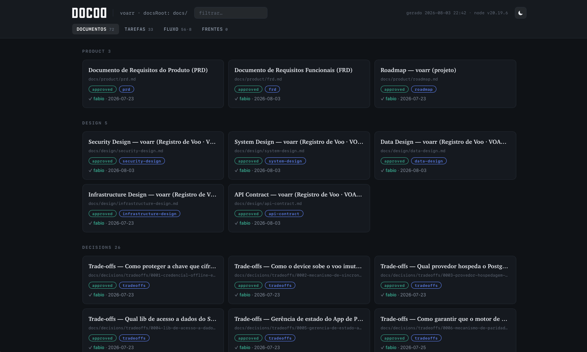
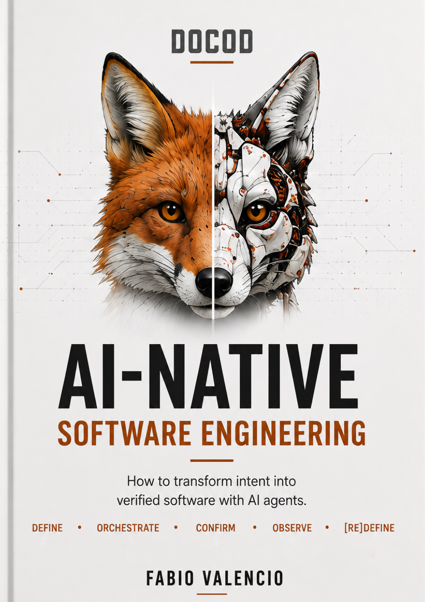

<div align="center">

<div align="center">

<br><sub>DOCOD</sub>
</div>

**D**efine · **O**rchestrate · **C**onfirm · **O**bserve · [re]**D**efine

**Agents write code fast. Speed was never the bottleneck. Context and governance were.**

DOCOD is an agent-driven development method with a governance runtime, for any repo, language, IDE, model, and harness. Its agents take your product **from "why" to shipped code**: they specify, design, extract tasks, **write the code**, test it against the requirements, and review the diff, all under rules derived from *your* project. And everything written (document or code) has an owner, declared inputs, a gate, and evidence. The human orchestrates; the agents deliver; **nothing approves itself**.

[](#license)
[](#requirements)
[](#install)

📖 [The book](https://docod.ai/book) · ✉️ [Daily challenge in 6 languages](https://docod.ai/challenge) · 🌐 [docod.ai](https://docod.ai)

</div>

---

## The problem it solves

Writing the spec first is the new standard, and it genuinely helps. But watch a spec-driven repo three weeks in. The spec says one thing, the code says another, and nobody can tell you exactly WHEN they stopped agreeing. The spec was approved with an "LGTM" in a chat that scrolled away, and silently outdated by the fourth pull request. A specification that doesn't enforce its own validity isn't governance — it's just a text file lying to your agents.

The missing layer was never more spec. It is what seals the spec to the work, **mechanically**. Not with good intentions, but with rules that don't bend:

- An agent delivers in **draft**; approving is a **human act**, recorded with author, timestamp and content hash.
- Edit an approved document and the approval **invalidates itself**: everything that depended on it re-blocks.
- **Evidence is cited, not asserted**: a deterministic check demands command + output, and whoever verifies is never whoever did the work.

The result: agents move at full speed, and every step has a name, a gate, and a receipt.

> **Why isn't a spec folder enough?** Because a spec is a claim, and claims drift. DOCOD's guarantees are hashes sealed to content: they hold when the session forgets, when the model changes, and when it's 2 a.m. and someone edits an approved spec — that edit invalidates the approval by itself, and everything downstream re-blocks until a human looks.

## None of this is new. That's the point

PRD, functional requirements, design review, ADRs, test plans, runbooks, postmortems: this is not a methodology someone invented last quarter. It's the **SDLC (Software Development Life Cycle)**: the discipline software engineering has taught for decades, the one that shipped everything you rely on. Every DOCOD movement maps onto a phase you already learned:

| Classic SDLC phase | DOCOD movement | The artifacts you'll recognize |
|---|---|---|
| Planning & feasibility | **Define** | business case |
| Requirements & analysis | **Define** | PRD, FRD, user stories |
| Design & architecture | **Orchestrate** | system/data/security design, API contract, ADR |
| Implementation | **Orchestrate** | tasks, code, evidence |
| Testing & verification | **Confirm** | test plan, QA, design review, code review |
| Deployment & operations | **Observe** | SLOs, runbooks, playbooks, release notes |
| Maintenance & evolution | **[re]Define** | postmortem, impact analysis, feeding the cycle again |

<sub>The table shows where each artifact is *most often* born. ADR and the other cross-cutting artifacts (RFC, tradeoffs, impact analysis) appear whenever the need does, in any phase; the map below marks them ⚡.</sub>

Most teams abandoned this lifecycle for one honest reason: writing and maintaining those documents was slower than writing the code.

AI inverted that equation, twice:

- **The documents became the input.** An agent's output is bounded by the context it receives. The spec stopped being paperwork *about* the system and became **the program that programs the agent**. A human developer fills gaps with judgment and hallway context; an agent fills them with plausible guesses. The discipline your team dropped is exactly what agents can't work without.
- **The cost that killed it is gone.** DOCOD's agents write and maintain these documents *with* you: interview, draft, cross-check, propagate changes. The historical reason to skip the lifecycle no longer exists.

So DOCOD isn't asking you to adopt something new. It's the SDLC you already know, revived, wired for agents, and enforced with gates instead of good intentions. **If you want AI to build software, this layer is no longer optional. It's the difference between engineering and generation.**

> 📐 Why the spec is back at the center, and how documentation becomes an execution system for agents: chapters 13 and 14 of **[the book](https://docod.ai/book)** (*Spec-Driven Development* and *Documentation as an Execution System*).

## See it work in 60 seconds

```bash
git clone https://github.com/docod-ai/getdocod
./getdocod/install.sh /path/to/your/project
cd /path/to/your/project
```

**Or install as a Claude Code plugin** (you subscribe to the method; your instance stays yours):

```
/plugin marketplace add docod-ai/getdocod
/plugin install docod@docod
/docod:setup-docod        ← once per repo; re-running it is the update flow
```

Two installs, two philosophies: the git clone copies the bundle so you can read and hack every contract; the plugin keeps it as a managed, always-current subscription. Either way, `docod.yaml` and everything you produce belong to you and are never touched.

Then, in your agent harness:

```
/docod:start        ← reads your repo and points at the right entry door
```

**Door A: start from "why"** (the investment needs justifying):

```
/docod:run business-case
/docod:approve docs/product/business-case.md --by <you>
/docod:run prd create_prd
/docod:approve docs/product/prd.md --by <you>
/docod:run frd create_frd
```

**Door B: straight to the product** (you already know what to build):

```
/docod:run prd create_prd
/docod:approve docs/product/prd.md --by <you>
/docod:run frd create_frd
```

Two doors, one pattern you'll see immediately: **agent delivers a draft → you approve → the next step unblocks.** The method bends to where the project really starts; the discipline is identical either way. And at any point:

```
/docod:status       ← what exists, what's valid, what's blocked — derived, never lies
```

> **Already have a PRD?** Import it: `/docod:run prd create_prd` normalizes it to `docs/product/prd.md` and returns `QUESTIONS FOR THE USER:` for whatever the text doesn't answer. Nothing gets assumed silently.

## The code is the point

The documents aren't the product. They're the **context the coding agents consume**. Half of the method is execution, and it ships in the same bundle:

```
/docod:run rules-factory generate_rules     your project's own rules — not generic advice
/docod:run task-extraction extract_tasks    tasks with success criteria the executor CANNOT edit
/docod:run task-executor execute_task       builds → verifies → fixes → hands to QA, citing evidence
/docod:run qa-executor run_qa               verifies BEHAVIOR against the requirements, running it
/docod:run code-review review_code          reviews the DIFF against your standards and the task
```

Two things make this different from pointing a raw agent at your repo:

**1 · The rules are yours.** `rules-factory` doesn't ship opinions. It **derives** coding standards, testing guidelines, CI/CD discipline and security rules from *your* ADRs, *your* designs and *your* code, asks you what can't be derived, and scopes each rule to a subtree (`paths:`). The adapter promotes them to where your harness actually reads (`CLAUDE.md`, `.agents/rules/`), so every line the executor writes is guided by decisions **you** made, with a traceable origin. A generic rule is worse than none: it makes review enforce taste with the authority of a norm.

**2 · Three reviewers, three objects: none reviews its own work.** `design-review` checks the document before code exists; `code-review` checks the diff; `qa-executor` checks the behavior, running it. The task-executor owns the build→QA→fix→QA loop but can't touch its own success criteria: an executor that edits its own bar self-approves through the back door. Every claim ships with evidence: command + output, cited, not asserted.

So no, the paperwork isn't the product. It's what makes the code **explainable**: every line traces back to a requirement, a design, a rule, and a decision with an owner.

**And you don't have to babysit one task's chain.** `/docod:loop` is the dispatch of a single task: you hand it over once and it carries the task through the non-human stretch (build, external verify, QA, fix rounds, diff review) without stopping at every station. It is not a batch runner: one task per dispatch, and parallel tasks are parallel dispatches. It comes back only for what is yours: questions handed back, a bug root-caused to an approved upstream document, a repeated failing verdict, anything needing approval (it never approves). "The human orchestrates" never meant clicking every station: the decision is the dispatch, the stop conditions are contract, and deploy remains a human act.

## A tech lead to think with

Every other agent produces. This one thinks **with you**:

```
/docod:lead should we split the payments service now or after the launch?
```

`tech-lead` is your sparring partner for technical decisions. It reads the whole project first (the approved PRD, the designs and their boundaries, the frozen ADRs, task state, what QA found, what went stale), then argues like a senior: two paths, what each costs, what it would do and why. Sources cited like an engineer cites (artifact and section, ADR number, file:line), disagreement stated plainly, and **the choice always handed back to you**. It never invokes agents, never approves, never decides.

It also knows the method better than you need to: hit a technical decision with alternatives and it flags "this needs an ADR"; a one-way door gets routed to `tradeoffs`; a change with unclear blast radius, to `impact-analysis`. And when the question is scope, sequence or priority, it points you to `project-management`: the two of them are your **council**, one on the technical axis, one on the project axis. Use either alone, or both when the question crosses lanes.

One more thing no chat-based advisor gives you: **counsel leaves a trail.** Every recommendation that changes a direction is appended to `docs/decisions/counsel.md`, with the question, the recommendation, the rationale with sources, and your call in your own words (even when it went against the advice). Six months later, "why did we do it this way?" has an answer with a date on it.

> 🧠 The judgment the tech-lead applies (which decisions deserve a gate, how to calibrate trust in an agent's output, where the human belongs in the loop) is unpacked in chapter 19 of **[AI-Native Software Engineering](https://docod.ai/book)**, *Human in the Loop*.

## See the whole project at once

```
/docod:report
```

<div align="center">

<br><sub>Static, offline, self-contained HTML. No server, no CDN, no tracking.</sub>
</div>

Documents grouped by nature with their effective status (an invalid approval shows up **red**, it doesn't disappear), a task kanban with progress derived from the checkboxes, what's possible vs. blocked (with the why), and your workstreams. Same state as `status`, with a face.

> 💡 **This walkthrough is the D of DOCOD, one of five movements.** The full cycle (orchestration, the human gate, sensors before humans, and the loop that reopens the definition with evidence) is chapter 11 of **[AI-Native Software Engineering](https://docod.ai/book)**; chapters 25 to 29 run the method end to end on real projects, with a stopwatch. Prefer to learn by doing? A challenge like this lands every morning in the **[newsletter](https://docod.ai/challenge)**, in 6 languages.

## A real checkpoint, verbatim

This is DOCOD closing the decision phase of a real project (voarr). Nothing staged: it is the message the method hands back at the milestone. Notice the last line, where it refuses to slice the MVP on its own, because that call is the human's.

> **The voarr decision phase is complete**
>
> From the approved PRD to the database provisioning, **18 artifacts, hash-consistent end to end** — and the path here carried the rigor you imposed: every one-way door weighted in proportion to what it decided, every rejected alternative recorded with a reason and a revision trigger, every unknown marked as a gap rather than invented.
>
> ```
> Product:    PRD · FRD (61 FRs)
> Design:     system · data · security · api-contract · infra   (+ design-review approved · impact 0001)
> Tradeoffs:  01 credential+key → A pure · 02 sync → B custom REST · 03 hosting → AWS RDS
> ADRs:       01 crypto · 02 Postgres · 03 N-back · 04 sync · 05 stack · 06 provisioning
> ```
>
> **The next door changes in nature — task-extraction**
>
> Up to now it was **deciding**; from here on it's **building**. [...] It's `interactive` — it will need a decision from you that hasn't been made yet: **the MVP cut**. The design covers nine modules; the MVP isn't all of them. How do you want to tackle it?
>
> - **You give me the MVP cut** and I launch task-extraction with that scope, or
> - **I launch task-extraction and let the agent propose** the slicing, and you correct the cut when it comes back, or
> - **We stop here** — the decision phase closed clean, and you pick the build back up whenever you want.
>
> I won't launch task-extraction on my own — the MVP cut is your call, and it's too big for me to presume.

Eighteen artifacts of context, every gate on record, and at the exact moment the decision gets big, the method stops and hands it to you. That is the whole product in one message: a senior copilot with brakes, not an eager generator.

## The rules nothing bends

This is the part no other tool gives you, and the reason a tech lead can trust an agent's output:

1. **An agent never approves**, not even its own artifact. It delivers in draft/review; approval is human, via `/docod:approve`, recorded as `approval: {by, at, content_hash}`.
2. **Validity is mechanical.** Edited the content after approval? The approval invalidates itself, `status` shows it, and everything downstream re-blocks. And when a sweeping-but-cosmetic change (a product rename) invalidates dozens at once, `docod.mjs rebless` re-approves in batch: plan shown first, your reason mandatory and recorded inside every approval it touches, ambiguous sources never guessed.
3. **Requires block upfront.** An action without an approved input doesn't run: `status` says exactly what's missing (and what's waivable, with the waiver recorded).
4. **Evidence is cited, not asserted.** A deterministic postcondition demands command + output in the report, and the computable part isn't even trusted to the agent: `docod.mjs verify` re-checks frontmatter, status, approval hash and every input hash mechanically, run by the caller. It also refuses a **truncated** document — fewer sections than the contract declares, a promised companion file missing, no final `status` — and flags a prose-cited hash nothing watches or a `file:line` anchor whose quoted fragment has drifted: `VERIFY OK` means the document is whole, not merely present. Whoever verifies behavior, diff, or design is never the one who did the work.
5. **A missing tool is not a license to improvise.** The capability degrades per the adapter and the document records "not verified". It never pretends.
6. **A subagent doesn't invent answers.** It stops and returns `QUESTIONS FOR THE USER:`; `/docod:run` asks you and reinvokes.
7. **A fix never patches around an approved document.** When QA root-causes a bug to an upstream artifact (a contract that omitted a field, a design that guessed wrong), the line stops: the owner amends, and re-approving amended content mechanically requires the mapped radius (`--impact <impact-file>`) or a recorded waiver. Code and design are never allowed to quietly stop agreeing.

## Where DOCOD sits, and what it refuses to be

| If you're using | It gives you | It cannot give you |
|---|---|---|
| A skill pack (TDD prompts, debugging loops, review checklists) | Better craft, task by task | Receipts. Nothing records what was approved, by whom, against which version of what |
| A process framework that owns your flow | Structure | Control. The process decides for you, and a bug in the process is yours to live with |
| A raw agent pointed at the repo | Speed | A trail. Code that runs, looks right, and nobody can explain |

DOCOD takes the opposite bet on all three axes at once. Craft stays **composable**: bring any skill you love. Control stays **yours**: commands inform and record, never decide; every gate is a human act; every guard ships with a recorded waiver, because a rule you can't consciously bypass is a rule you'll route around. And everything gains a **receipt**: hash-sealed approvals, external verification, lineage from requirement to diff.

**Skills make the work better. DOCOD proves the work happened, and that it still holds.**

> **"Doesn't this own my process?"** No, and that refusal is load-bearing. Everything is plain files in your repo. The runtime derives state and reports it; it never invokes an agent on its own. Approval is a record, not a forum. When you disagree with a gate, you waive it and the waiver is recorded: the method's job is that nothing happens silently, not that nothing happens without permission.

### Bring your own skills

DOCOD's 13 skills are method-neutral, and the method is not a walled garden: install any skill from anywhere (a TDD skill, a debugging loop, your team's review checklist) and use it inside a `/docod:run` task or a `/docod:loop` dispatch. The executor writes code with whatever craft you hand it; DOCOD governs what surrounds the craft: inputs declared and hashed, success criteria the executor cannot edit, adversarial QA, verified delivery. Your favorite skills and DOCOD compose. That is the design, not an accident.

## Working in a legacy codebase

Honest answer: the strongest path in legacy is to **scope DOCOD to the feature you're adding**, not to boil the ocean. `/docod:start` detects existing code and offers the `reverse_*` door; the sequence that works is:

```
/docod:run rules-factory extract_from_code    per target: distill the patterns the
                                              code ALREADY has into verifiable rules
/docod:run system-design reverse_design       rebuild only the boundaries you'll touch
                                              (+ data-design / api-contract reverse_*
                                              if the feature touches data or a consumed
                                              interface), then approve: it's the baseline
/docod:run prd create_prd                     in ws scope: the feature's PRD stands on
                                              its own — the project PRD may never exist,
                                              and that's by design
```

From there it's the known cycle: frd → tasks → build. If `impact-analysis` reveals the change touches other people's things, the `rfc` enters derived, not as a style choice.

Two things make this honest instead of hopeful. First, `rules-factory extract_from_code` is the highest-value opening move in legacy: it gives the executor a ruler made of your codebase's own patterns before anything changes. Second, every fact the `reverse_*` actions rebuild carries declared provenance (`evidence | inferred | user-supplied`), so you always know what was read from the code, what was deduced, and what you told it. An `inferred` that matters becomes a question, never a silent fact. And divergence is a first-class, numbered object: a **DIV** is any *claim vs reality* mismatch — an old doc, or another part of the code's own stated contract, contradicted by what the code actually does — with evidence on both sides; a **RISK** is the one-sided finding the code carries on its own (PII exposed, a one-click destructive action), same evidence bar, an owner each. You get the numbered report of where your system already stopped agreeing with itself.

**And you can get that report without adopting anything.** `/docod:diagnose` runs the reverse in diagnostic mode — no approvals, no pins, no gates: point it at your repo and it returns the evidenced map plus the numbered DIV and RISK tables, every finding cited to `file:line` with an owner, and a queue of the questions only an outside owner can close. Everything it produces is a dated snapshot: your system leaves **pre-read, not pre-approved** — adopting the full method later is a human vouching those artifacts forward, with the reading already done. It's the honest first look; the scoped cycle above is for whoever the findings scared. And you're not left alone with the findings: `/docod:lead` is the resident guide — it derives where you actually are (`status` + the artifacts, never a memorized script) and answers "now what?" with the next step, the why in the method's terms, and the exact command to run. It shows the move; you make it. The tool teaches the discipline adopting it requires.

## The four layers

The method doesn't know your stack. That's by design, and it's **enforced by a validator, not aspirational**:

| Layer | Lives in | Says |
|---|---|---|
| 1–2 · **spec** (neutral) | `spec/` | **what**: method, 28 agent contracts, 37 artifacts, commands, rules, 13 skills |
| 3 · **adapter** (pluggable) | `adapters/` | **which tool**: every tool name lives here. If it shows up in the spec, it's a leak |
| 4 · **instance** | `docod.yaml` | **where and in which language**: your paths, your project. The only thing that changes between repos |

Swap the adapter, keep the method. And the **product speaks your language**: set `language: pt-BR` (or `es`, `de`, …) in `docod.yaml` and every artifact, inquiry question and report comes out in it. The method speaks English, the product speaks yours.

## Commands

```
/docod:start                       where to enter, given what already exists
/docod:status                      what exists, what's valid, what's blocked
/docod:run <agent> [action] [ws]   invoke an agent
/docod:approve <file> --by <who>   the human gate
/docod:continue <ws>               resume a workstream
/docod:ws list|done|abandon        workstream lifecycle
/docod:report                      HTML dashboard: documents, kanban, flow
/docod:lead [topic]                your tech lead: sparring for technical decisions
/docod:loop <task> [--until]       dispatch one task through build→QA→review, no babysitting
```

## The map: who comes after whom

Derived from the real `requires` in the contracts. This is a snapshot of the model; the **live** answer is always `/docod:status`, which computes possible/blocked against what exists right now.

```
legend    ● core    ○ dispensable — use it if the project calls for it
          ⚑ human gate (/docod:approve)    ⚡ cross-cutting — any time

DEFINE       ○ business-case (why invest?)
                    │ waivable
                    ▼
             ● prd ⚑ ───────► ● frd ⚑
                                  │
ORCHESTRATE                       ▼
             ● system-design ⚑ ──┬──► ○ infrastructure-design (capacity/cost)
               (the boundaries)  └──► ○ observability → slos (SLI/SLO/alerting)
                  │
                  ├── ○ data-design      — has data of its own? use it
                  ├── ○ api-contract     — someone consumes your interface? use it
                  └── ○ security-design  — has an attack surface? use it
                  │
CONFIRM      design-review ► verdict on the designs (agent gate)
                  ▼
             ● task-extraction → tasks ⚑
                  │     └─► ○ test-plan · ○ user-stories · ○ project-management
                  ▼
             ● task-executor (code + evidence)
                  ⇅ builds → verifies → fixes
             ● qa-executor (behavior) · ● code-review (diff)

OBSERVE      ○ runbook · ○ playbook (born from the slos)
             ○ integration-guide (born from the api-contract)

[re]DEFINE   ○ release-notes (on release) · ○ postmortem (on incident)
                  └─► impact-analysis propagates what the incident/change invalidated

CROSS-CUTTING ⚡ — triggered by NEED, not by stage:
  adr             technical decision with alternatives ("Postgres instead of Mongo")
  tradeoffs       deep dive when the cost of BEING WRONG is high (one-way door)
  rfc             when the cost of DECIDING ALONE is high (people affected)
  impact-analysis something changed — what went stale, who fixes it
  rules-factory   distills project patterns into rules the executor obeys
  tech-lead       your sparring partner: reads everything, recommends, logs counsel
```

**Dispensable is not decorative.** ○ means the method works without it, but each one exists because its absence has a known cost (skip `test-plan` → QA with no traceability matrix; skip `slos` → alerting by gut feeling). Dispense knowing what you're giving up.

## Product decision × ADR: don't confuse them

| | `decisions/log/` | ADR |
|---|---|---|
| what | a **product** answer from the inquiry | a **technical** decision with alternatives |
| example | "primary persona = operator" | "Postgres instead of Mongo, because…" |
| recorded by | the agent that asked, automatically | **only the `adr` agent**, invoked by you |
| shape | append-only yaml fact, with provenance | numbered, immutable document, with consequences |

An ADR **never** gets born inside another agent. When the frd (or any agent) hits a technical decision, it stops and flags that an ADR is missing there; you decide whether to run `/docod:run adr record_decision`. A technical choice with discarded alternatives and no ADR is a gap, and the fix is to give it an owned record.

## Where the documents live

`docsRoot` is the instance's call (`docod.yaml`, default `docs/`). Stage is metadata, not a folder. Grouping is by nature:

```
docs/
  product/       prd, frd, business-case, user-stories, roadmap
  design/        system-design, data-design, api-contract, security-design, infra
  decisions/     adr/, rfc/, tradeoffs/, log/
  quality/       design-review, impact
  ops/           runbooks/, playbooks/, postmortems/, slos
  releases/      release-notes, integration-guide
  standards/     rules generated by rules-factory
  workstreams/   {ws}/ · workstreams.yaml (the registry)
```

Target-scoped artifacts (tasks, evidence, qa, code-review) live next to the code, in `{target.tasksRoot}`: whoever executes reads there.

## Workstreams

A workstream is **born** when `prd` runs in ws scope (registered in `docs/workstreams.yaml`), **lives** in `docs/workstreams/{ws}/`, and **dies** via `/docod:ws done` or `abandon --reason "..."`. The reason is mandatory; a workstream that vanishes in silence is lost work with no record. A folder without a registry entry doesn't create a workstream: `status` reports it as a finding.

## Install

```bash
./install.sh /path/to/your/project
```

What lands in the project:

- `.docod/`: the bundle (recreated on every sync; don't edit here)
- `docod.yaml`: the instance, **yours**. Created once, never overwritten
- `.claude/agents/docod-*`: the agents as native subagents
- `.claude/commands/docod/`: the orchestration commands
- `.agents/docod/skills/` + symlinks `.claude/skills/docod-*`
- a DOCOD block in `CLAUDE.md` + `AGENTS.md` (created as a symlink if absent), so **any** harness that reads them (Codex, Gemini CLI, Cursor, Kimi, Copilot) discovers the method: the slash commands are a Claude Code bonus, not the only door

**Merge rule:** everything of ours is namespaced (`docod`); what isn't ours is **never touched**. A same-named file that isn't ours: the installer warns and skips. Running again updates the bundle and preserves the rest. That's also the update flow.

## Your docod.yaml, in one minute

The installer creates it at your project root on the first run, and **never touches it again**: it is the only file in the whole method that is yours to edit. Everything else derives from it. When the template gains new fields, a reinstall warns you and points at the reference copy in `.docod/docod.yaml`; adding them is your call.

```yaml
project:
  name: "my-project"
  spec: ./.docod/spec/     # where the method's spec lives; leave as is

adapter: claude-code       # swap this line, swap the harness

language: en               # everything the method PRODUCES (artifacts, inquiry
                           # questions, reports) comes out in THIS language.
                           # The method speaks English; the product speaks yours.
                           # e.g. pt-BR, es, de

docsRoot: docs/            # where artifacts live; grouping inside is by nature
                           # (product/ design/ decisions/ ops/ ...), never by stage

topology: single           # single | monorepo | multi-repo
targets:
  app:
    path: .
    stack: []              # your stack; the bundle doesn't know it and shouldn't
    tasksRoot: tasks/      # tasks and evidence live here, next to the code
```

When to edit it: right after installing, and usually only twice. Set `language` if your team doesn't work in English, and shape `targets` to your repo. A monorepo looks like this, and it is the difference between the method seeing half your tasks and all of them:

```yaml
topology: monorepo
targets:
  api:  { path: services/api/, tasksRoot: services/api/tasks/ }
  web:  { path: apps/web/,     tasksRoot: apps/web/tasks/ }
```

Every path template in the method resolves against these targets, one pattern per target: rules, tasks, evidence, QA. Get `tasksRoot` right and `status`, `report` and `verify` see everything; get it wrong and they tell you what they can't find instead of pretending.

## Requirements

- **install**: bash. Nothing else.
- **command runtime**: node ≥18 (YAML ships vendored: no python, pip, or npm install). Without node, commands become manual: the agents still check requires and warn; the gate is never skipped.
- python is not needed for anything that gets installed.

## Who made this

<a href="https://docod.ai/book"></a>

Created by **[Fabio Valencio](https://docod.ai)**, author of *AI-Native Software Engineering* and creator of the DOCOD method. The book is the why and the how behind everything in this repo: 27 chapters from context engineering to a full DOCOD cycle run with a stopwatch.

If DOCOD earns a place in your workflow, the best way to support it:

⭐ **Star the repo** · 📖 **[Read the book](https://docod.ai/book)** · ✉️ **[Take the daily challenge](https://docod.ai/challenge)**

That's what keeps the method evolving.

## License

MIT. Use it, adapt it, build on it. If you ship something with it, a link back to [docod.ai](https://docod.ai) is appreciated (and helps the method survive).

---

<div align="center">
<strong>The future is AI-native.</strong><br>
<a href="https://docod.ai">docod.ai</a>
</div>
